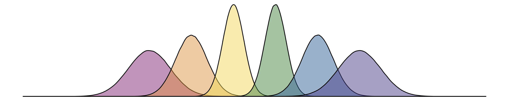

```{r setup, include = FALSE}
source("R/psyteachr_setup.R")
```


```{r, eval = FALSE, echo = FALSE}
n <- 1e6
means <- c(40, 60, 80, 100, 120, 140)
sds <- c(10, 7.5, 5, 5, 7.5, 10)

logo <- tibble(
  grp = rep(LETTERS[1:6], each = n),
  val = rep(means, each = n) +
        rnorm(n*6, 0, rep(sds, each = n))
) %>%
  ggplot(aes(val, fill = grp)) +
  geom_density(alpha = 0.5, show.legend = F, trim = FALSE) +
  scale_fill_manual(values = psyteachr_colours()) +
  xlim(-20,200) +
  theme_void()

ggsave(logo, "img/hydb.png", width=10, height=2)
```

```{r logo, echo=FALSE, out.width="100%", fig.align="center", fig.width = 10, fig.height = 2, warning = FALSE, fig.cap=""}

```

## Schedule

Please install R in advance by following [instructions for Installing R on Your own Machine](r_instructions.html).

### Monday, the 15th of April (first day)

09.30 - Welcome (Team HYDB)
09.45 - Thinking like a computer (Carolyn Saund)  
10.30 - Introduction to tidy data (Shannon McNee)   
11.30 - R Markdown (Rebecca Lai)   
14.00 - Quantitative data visualization (Jack Taylor)  
15.15 - Qualitative data visualization (Stephanie Allan)  

### Tuesday, the 16th of April (second day)

09.45 - [Crowdsourcing better research](https://osf.io/x629g/) (Prof Lisa DeBruine)  
11.30 - Visualizing the headlines (Shannon McNee)   
14.00 - Scraping and visualizing Twitter data (Anna Henschel)   
15.45 - R Markdown Websites (Rebecca Lai)  

### Wednesday, the 17th of April (third day)

09.45 - Your data and visualizations (Lovisa Sundin)  
11.15 - Wrap up (Team HYDB)  


### Podcast

<audio controls style="float: right;"><source src="files/hack_your_data_podcast_2.mp3" type="audio/mpeg"></audio>

[Amelia Hilton](https://open.spotify.com/show/4xm16tF5ib3w4FWWz0ZOAg){target="_blank"} interviewed the Hack Your Data Beautiful team about their first coding experiences in R and what tips they would give beginners.  


## Introduction

Coding is a skill that can be picked up by people from all backgrounds, for any kind of data. Everyone can be a data scientist! Coding skills provide tools to enhance communicating your data and ideas to a wide range of audiences and disciplines. If you’ve ever wanted to learn how to make your own website or to visualise your data in a way that is engaging and rigorous, coding is for you. In addition, showcasing your findings in new ways may help you look at your data from a different perspective and lead to a deeper understanding of data.

With the open science movement, more and more qualitative and quantitative data will become freely accessible - learning data science and visualization skills will empower you to take advantage of that! We'll show you how R is incredibly useful (and cutting-edge) in the arts and humanities, for example allowing you to quickly gather publicly available data (like popularity of different baby names in the UK) in R, create beautiful word clouds from large numbers of twitter posts, and visualise qualitative relationships between concepts in dendrograms! Coding can be playful, fun and beautiful -- did you know that there is even the possibility to create artworks, animations, and interactive 3D graphs in R? Once you have tried coding yourself, you might never want to go back to dreary Excel graphs!

This workshop is sponsored by the [Scottish Graduate School of Social Science](https://www.sgsss.ac.uk/training/spring-into-methods/).

```{r map, out.width="100%", fig.width=9, fig.height=4.5, message=FALSE, warning = FALSE}

library(tidyverse)

map_data("world") %>%
  mutate(startsA = substring(region, 1, 1) == "A") %>%
  ggplot(aes(x=long, y=lat, group=group, fill=startsA)) + 
  geom_polygon(show.legend=FALSE) +
  labs(title = "Countries starting with the letter A",
       caption = "A plot made with the 9 lines of code above.",
       x = "Longitude", y = "Latitude") +
  scale_fill_manual(values = c("grey", "dodgerblue"))

```


## Aims, objectives and learning outcomes

* Foster a supportive exchange between PhD students across disciplines in Scotland who work with quantitative and qualitative data to facilitate interdisciplinary collaboration and peer empowerment
* Give PGRs in the Arts & Humanities and Social Sciences an introduction to the vast capabilities of coding in R for both quantitative and qualitative data using topical, current and fun examples 
* Highlight the flexibility, rigour and open nature of R and showcasing its diverse areas of application: qualitative stats, online surveys in FormR, building a website, web scraping, text mining and data visualisation.
* Demonstrate a variety of dissemination techniques for cascading good scientific techniques and practices to different audiences in ways that are open, inclusive and transparent
* To take the fear out of coding
* Showcase progress over the sessions and solidify learning and future intentions by producing a blog, podcast, or research poster

## About the Workshop

### Format

This event will be an opportunity for people who are brand new to coding  (or want to learn more) to learn how the open source (and free to download) coding platform R is useful in research communication. 

Each day there will be brief input from researchers from different disciplines demonstrating how they use R to make powerful, accessible data visualizations. But the workshop will predominantly focus on hands-on experience of working with data directly related to concrete, topical real life examples. 

Day one will be spent covering the basics - how to get up and started. Day two will demonstrate the  powerful practical applications of R data visualisation in communicating complex ideas and provide participants with the opportunity to develop these skills in the context of their own data and research.  Day three will focus on community building and sharing good practice activities. 

### Prior learning required by participants 

No prior experience of coding or any other software is needed. The event has been designed with absolute beginners in mind.  


### Learning materials

All materials utilised over 2.5 days will be provided through open source webpages (https://psyteachr.github.io/hack-your-data/) to support continued learning. This will include series of podcasts discussing personal experiences of beginning coding journey with R (highs, lows, challenges, advice) developed by the PGR workshop leads and the participants together.
