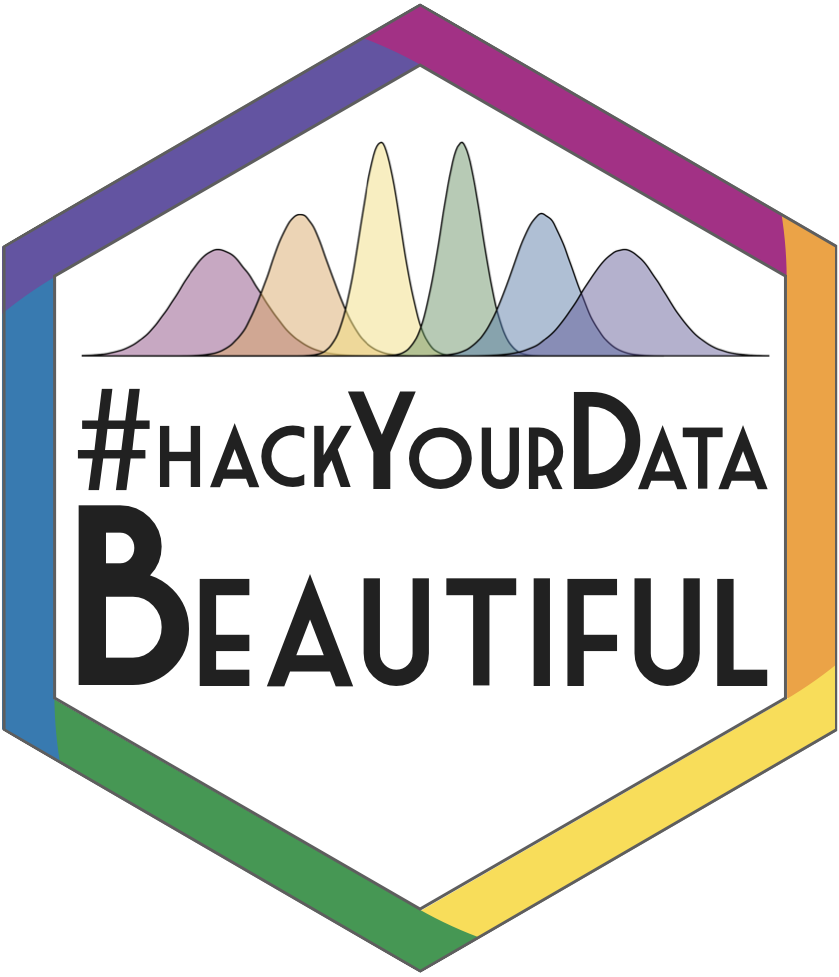

## Loading Libraries 

```{r, message = FALSE}
library(tidyverse)
```

## Introduction to Tidyverse

In an ideal world, we would conduct our research, collect our data - whether that be quantitative or qualitative - and then analyse our data using R as our tool. But, just like learning and using any language, it's often not that straight forward!

Data can be messy and often times we need to clean our data before we can make any sense of it. 

## Our Messy Data 

So, let's have a look at what a messy dataset can often look like. 

```{r data_real, echo=FALSE, message=FALSE} 
eye_data <- read_csv("files/intro-to-tidy-data/eye_descriptions.csv")
```

```{r data, eval=FALSE} 
eye_data <- read_csv("eye_descriptions.csv")
```

Here, we have loaded in a .csv file which contains 220 participants descriptions of 50 different eye regions (columns t1 through to t50). There's a lot of information here, we have: user_id (a unique, anonymised identification number), the participant's sex, their age, and their description of each eye region (t1:t50).

If we have a look at these descriptions, we can see that there's a lot of variation. Some participants provided one word descriptions whilst others provided multiple word descriptions. Some wrote their descriptions in lower case, whilst others wrote in upper case and used punctuation (e.g. commas, hyphens, slashes). As a result, this data isn't organised in a clear, logical way. 

Being faced with such complex data can be daunting, we may feel overwhelmed and ask ourselves: 

* How can I organise this data?
* How can I make this data meaningful?
* How can I make this data **tidy**? 
* Why should I even bother? 

Some have estimated that 80% of data analysis is actually spent on data preparation (Dasu & Johnson, 2003), getting your data into a usable format before you even think about analysing it. Many people spend days, weeks, and even months labouring over data cleaning in Excel which involves numerous point and click repetitions. This isn't only stressful for you as a researcher, but it's an inefficient use of time and resources which could in turn impact on your own productivity but also the productivity of your lab or research group.  

The way to get over this hurdle is through developing skills in **DATA WRANGLING**. 

One of the amazing things about R being open source and available to all is that **ANYONE** can write code, functions, and packages and make them freely available to all.

That's great news for us because this crowdsourcing approach to coding has given us the **Tidyverse**. 

## What is the Tidyverse? 

The Tidyverse is a collection of R packages with a common design philosophy, grammar, and data structure that makes analysis faster, easier, and fun. 

One of the key underlying structures of the tidyverse is that data structures follow a tidy format: 

1. Each variable is in a **column**
2. Each observation is a **row**
3. Each value is a **cell**

If you make sure your data is tidy, you'll spend less time rummaging through rubbish on your research path and spend more time working on your all important analysis! 

## The Wickham Six 

Hadley Wickham, a driving force behind the Tidyverse, argues that 90% of data analysis can be reduced to operations which can be described by six English verbs. 

* `select()`
* `group_by()`
* `filter()`
* `mutate()`
* `arrange()`
* `summarise()` 

Other verbs are also incredibly useful, including:

* `gather()`
* `spread()`
* `separate()`

We're now going to use can these verbs to help us clean up our eye descriptions data set in order to find the top 10 most common descriptors that we can then visualise in a lovely, clear plot. 

## Gather

Remember what we said about the three fundamentals of tidy data: each variable is a column, each observation is a row, and each value is a cell. 

Let's take a look at our dataset...

This data is not tidy. Although each row belongs to a unique subject id, each face id has its own column rather than being grouped with descriptions spread across these 50 columns. This data is arranged in what is called WIDE format. Variables are spread across columns, rather than gathered.

Let's have a go at tidying this up by gathering our face_ids into one column in order to get our data into LONG format. 

```{r gather}

gathered_eyes <- gather(eye_data, "face_id", "description", t1:t50)

```

Great! So now our data is in long format. Our face ids are in one column (face id) rather than being spread across 50. Now, each row has one observation - meaning that we firstly have all participants descriptions of face t1, followed by all participants descriptions of face t2, and so on...

But we're not done yet! Some participants didn't just provide one description per face. In our description column, we're met with lots of extra characters that are going to throw a wrench into our data analysis (e.g. hyphens, commas, slashes). Luckily, though, there's a way around this. 

## Separate 

Separate allows us to split apart a given column into multiple columns. Say we're interested in breaking apart the descriptions that people have given into three different columns, one per description. 

```{r separate} 

separated_eyes <- separate(gathered_eyes, description, c("d1","d2","d3"), sep = "(,|;|\\/)+", extra = "merge")

gathered_separated_eyes <- gather(separated_eyes,"desc_n", "description", d1:d3)

```

But, not everyone provided three descriptions so we have some missing values (NAs). We also have some nonsense descriptions (e.g. "f" and "."). How do we get rid of these? 

## Filter

Filter finds rows/cases where conditions are true. Here, let's use filter to get rid of NAs and any nonsense descriptions. 

The `!` inverts a statement, so in the case of `!is.na()` we are telling R to keep an item as long as it "is not NA". 

```{r filter} 

filtered_eyes <- filter(gathered_separated_eyes,
                        !is.na(description),
                        nchar(description) > 1)

```

Are we done? Let's have a look...

We still have some white space around descriptions as well as some descriptions in capitals. Here's where mutate comes in. 

## Mutate

Mutate helps to transform existing columns in order to make the data easier to work with. 

```{r mutate} 

mutate_eyes <- mutate(filtered_eyes,
                      description = trimws(description), 
                      description = tolower(description))

```

Great - so now we're in a position to find out something about our data. What are the most common descriptions? 

## Group_by

Group_by takes an existing data table and turns it into a grouped table so that all later operations are performed on each group. 

So, let's try grouping our data by description so that we can find out how many of each description we have. 

```{r grouped}

grouped_eyes <- group_by(mutate_eyes, description)

```

We can see here that grouping doesn't do much on the surface, but if we use head()...

```{r head}

head(grouped_eyes)

```

We can see that our data is now grouped by description, awaiting further instruction. So, let's see how many of each description we have. 

## Summarise

Summarise takes a data table and provides summary statistics (in this case the total number of each description) in a new table. 

```{r summarise} 

sum_eyes <- summarise(grouped_eyes, n = n())

```

Now we actually have some interesting information about our data! We can see how common each description is.

Let's see what the top 10 descriptions are...

## Arrange

Here, we can use the arrange function to sort our descriptions in descending order (most common description to least common). We can then use filter to only keep rows 1:10 to give us our top 10 most common descriptions. 

`desc()` tells `arrange()` to sort our variable in descending order (largest to smallest). 

```{r arrange}

arranged_eyes <- arrange(sum_eyes, desc(n)) 

top_10_descriptions <- filter(arranged_eyes, row_number() < 11)

knitr::kable(top_10_descriptions)
```

So from that expansive, messy dataset we now have the 10 most common descriptors provided by participants across 50 different faces! 

But, there's a way to make all of these above steps even more powerful...

## Pipes 

Notice that we started off with a variable called eye_data, and then it became gathered_eyes,and then separated_eyes, and then filtered_eyes and so on. 

Even though all of the steps we just carried out are important - it is key to point out that these are intermediate steps that get us from our messy original dataset to our clean, tidy, top 10. It would be much nicer not to have to do all of this record keeping, and it would make the code much more readable and powerful. 

Just like in spoken and written language, our verbs can be tied together to tell a story.  

The pipe operator %>% can be read in English as "and then". This operator allows us to string functions together to form a single, powerful pipeline. 

```{r pipe_real, echo=FALSE}

eyes <- read_csv("files/intro-to-tidy-data/eye_descriptions.csv") %>%
  gather("face_id", "description", t1:t50) %>%
  separate(description,
           c("d1","d2","d3"),
           sep = "(,|;|\\/)+",
           extra = "merge") %>%
  gather("desc_n", "description", d1:d3) %>%
  filter(!is.na(description), nchar(description) > 1) %>%
  mutate(description = trimws(description),
         description = tolower(description)) %>%
  group_by(description) %>%
  summarise(n = n()) %>%
  arrange(desc(n)) %>%
  filter(row_number() < 11)

knitr::kable(eyes)

```

```{r pipe, eval=FALSE}

eyes <- read_csv("eye_descriptions.csv") %>%
  gather("face_id", "description", t1:t50) %>%
  separate(description,
           c("d1","d2","d3"),
           sep = "(,|;|\\/)+",
           extra = "merge") %>%
  gather("desc_n", "description", d1:d3) %>%
  filter(!is.na(description), nchar(description) > 1) %>%
  mutate(description = trimws(description),
         description = tolower(description)) %>%
  group_by(description) %>%
  summarise(n = n()) %>%
  arrange(desc(n)) %>%
  filter(row_number() < 11)

knitr::kable(eyes)

```

## Visualising this data 

Now, we have informative data that is capable of being plotted! Don't worry if you struggle to understand data visualisation at the moment as later in the workshop we will be covering lots more on data visualisation. 

```{r eye descriptions}

eyes %>%
  mutate(description = factor(description, levels = description)) %>%
  ggplot(aes(description,n, fill = description)) +
  geom_col(show.legend = FALSE) +
  coord_flip() +
  scale_fill_brewer(palette = "Spectral") +
  ggtitle("Top 10 descriptors for eye region expressions")

```

Through using powerful tools within the Tidyverse we have been able to tidy our messy dataset in order to create a clear, accessible visualisation which provides us with interesting information about our data. 

## Conclusion 

Data cleaning doesn’t have to be time consuming and stressful - with the right tools, you are more than capable of hacking your data tidy which has a range of benefits for your productivity, your stress levels, and your ability to communicate your research clearly and effectively. 

## Resources 

[University of Glasgow MSc Research Methods of Psychological Science Data Skills Course](https://gupsych.github.io/data_skills/index.html)
[Data wrangling cheat sheet](https://www.rstudio.com/wp-content/uploads/2015/02/data-wrangling-cheatsheet.pdf)


