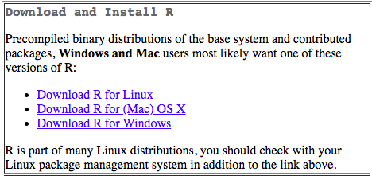

```{r logo, echo=FALSE, out.width="100%", fig.align="center", fig.width = 10, fig.height = 2}
knitr::include_graphics("img/hydb.png")
```


## Installing `R` {#installing-r}

Installing R and RStudio is usually straightforward. The sections below explain how and [there is a helpful YouTube video here](https://www.youtube.com/watch?v=lVKMsaWju8w).

## Installing Base R

[](https://cran.r-project.org/)

Install base R from <https://cran.rstudio.com/>. Choose the download link for your operating system (Linux, Mac OS X, or Windows).

If you have a Mac, install the latest release from the newest `R-x.x.x.pkg` link (or a legacy version if you have an older operating system). After you install R, you should also install [XQuartz](http://xquartz.macosforge.org/) to be able to use some visualisation packages.

If you are installing the Windows version, choose the "[base](https://cran.rstudio.com/bin/windows/base/)" subdirectory and click on the download link at the top of the page. After you install R, you should also install [RTools](https://cran.rstudio.com/bin/windows/Rtools/); use the "recommended" version highlighted near the top of the list.

If you are using Linux, choose your specific operating system and follow the installation instructions.

## Installing RStudio

Go to [rstudio.com](https://www.rstudio.com/products/rstudio/download/#download) and download the RStudio Desktop (Open Source License) version for your operating system under the list titled **Installers for Supported Platforms**.
