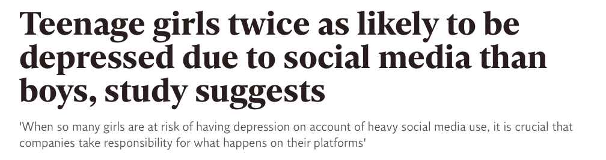
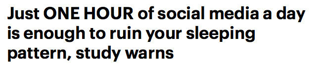
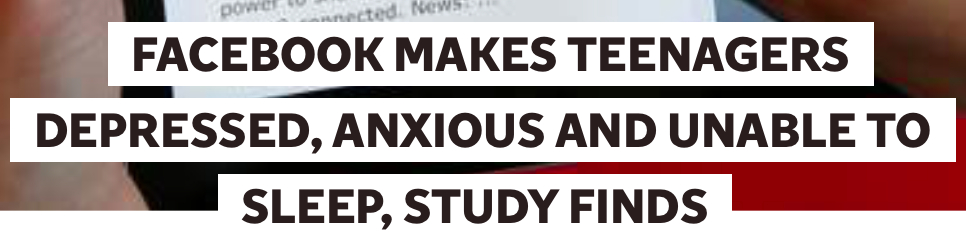

## The Importance of Transparency 

Typically, our aim as researchers is to conduct meaningful work which will be shared with the public, whether that be in the form of a journal article, presentation, or book chapter - for example. As a researcher, you have a responsibility to ensure that your conclusions follow logically from the data you have analysed. It is also your responsibility to ensure you communicate your findings in a clear, accessible way for general audiences. 

The importance of communicating your findings in this way is highlighted by the recent coverage of social media use research in the media. 

## Social Media Use, Mental Wellbeing, and Sleep in Adolescents 

Social media use is an important form of social interaction for young people, with social media becoming the primary form of communication for young people in the UK (Ofcom, 2017) and beyond (Pew Research Center, 2015). Published negative associations between increased social media use, poor mental wellbeing, and sleep problems (Kelly et al., 2019; Sampasa-Kanyinga et al., 2018; Twenge et al., 2017; Woods & Scott, 2016) have been covered widely in the national and international media - thereby contributing to public understanding of the relationship between social media use and wellbeing in young people. 






Something that these headlines have in common is that they all present a causal link between social media use and wellbeing in young people. In other words, social media is viewed as **causing** mental health problems or **causing** sleep problems. But, the truth is, we don't know that yet. 

All of these studies rely on **correlational** data - data which can give us information about the **strength** of relationship between two variables, but not the direction. This means that, from this data, we cannot determine whether social media use causes mental wellbeing and sleep problems, or vice versa - that mental wellbeing and sleep problems drive increased social media use. 

Importantly, when discussing these findings, the media - and researchers- often skip over the **strength** of these correlations and instead focuses on whether the relationship is **statistically significant** (p < 0.05). This approach is flawed. By focusing solely on statistical significance, researchers and the media are failing to educate the general public about the **practical significance** of the relationship between social media use, mental wellbeing, and sleep in young people. What impact does this relationship actually have in the real world? 

## Visualising Practical Significance

Let's visualise some relationships so we can understand this a bit better. Here, I'm going to use a tool developed by Kristoffer Magnusson over at R Psychologist (https://rpsychologist.com/d3/correlation/) for interpreting correlations.

So, let's have a look at some examples from the research behind the headlines I presented earlier. Twenge and colleagues' (2017) study argues that an increase in teen depression and suicidality is associated with increased screen-time. Let's examine the practical significance of this. 

The app asks for one input, the sample size (i.e. how many people were studied). This study examined a whopping 506,820 American adolescents, it would take a good bit of time to generate that many data points so let's generate 1000.  When controlling for sex, race, socioeconomic status, grade, and region - this study found a correlation of .03 between social media use and depression. What does that look like? 

This relationship accounts for just 0.1% of variance...does that sound like a practically significant effect to you? 

Let's look at suicidality. When controlling for the same confounders as above, electronic device use and suicidality were positively correlated (.13). But again, this relationship accounts for just 1.7% of variance. 

So, even though these relationships are **statistically significant** they may lack **practical significance**. 

## Why should I care? 

Even though on the surface this may sound extremely quantitative, neglecting the practical significance of results has considerable implications for wider society. Research directly feeds into the development of public policy and clinical practice. Basing the development of guidelines and interventions off of weak evidence is therefore a waste of time and resources. In addition, the general public deserve to take part in the debate around young peoples social media use fully informed of all the evidence. As a result, focusing solely on the statistical significance of the relationship between social media use, mental wellbeing, and sleep has the potential to bias public understanding. 

## Visualising This Data in R 

Importantly, there are ways to visualise data in R that can help communicate your findings in a more accessible way to general audiences. 

Let's have a look at the data I collected for my MSc thesis. In this study, I was interested in seeing whether using social media in a passive way was associated with increased comparison behaviour, emotional investment in social media, worry, and sleep problems. 

Let's get our packages ready! 

```{r prep, message=FALSE}

library(tidyverse)
library(corrplot)
library(psych)
library(viridis)

```

Now let's download and load in our data...

**Dataset: [correlations_heatmap.csv](files/visualising-the-headlines/correlations_heatmap.csv)**

```{r realprep, echo=FALSE, message=FALSE}
correlations_heatmap <- read_csv("files/visualising-the-headlines/correlations_heatmap.csv")
```

```{r prep2, eval=FALSE, message=FALSE}

correlations_heatmap <- read_csv("correlations_heatmap.csv")

```

...and have a look at it.
```{r head}

head(correlations_heatmap)

```

So columns 1 and 2 give us the name of the variable, and column 3 gives us an r value which just tells us the strength of the relationship. These values range between +1 and -1. 

## geom_tile()

So, now we have information about the **strength** of the relationship between these variables. But, looking at these numbers by themselves isn't very intuitive for a general audience. 

Luckily, R helps us communicate the strength of these relationships through **colour**. 

```{r tile}

ggplot(correlations_heatmap, aes(V1,V2, fill = r)) +
         geom_tile(aes(fill = r))
    
```

So, here, the closer the tile is to light blue then the stronger the relationship in a positive direction (i.e. as passive increases, so does ability comparison). The closer the tile is to navy, then the stronger the negative relationship (i.e. as rumination increases, sleep health decreases).

But, we can add more information here. What is the actual numeric value of the correlation?

```{r tile2}

ggplot(correlations_heatmap, aes(V1,V2, fill = r)) + 
  geom_tile(aes(fill = r)) +
  geom_text(aes(label = paste(round(r,1))))
       
  
```

Okay...we're getting somewhere. But the text on the x axis is hard to read, let's flip it round. 

```{r tile3} 

ggplot(correlations_heatmap, aes(V1,V2, fill = r)) + 
  geom_tile(aes(fill = r)) +
  geom_text(aes(label = paste(round(r,1)))) + 
  theme(axis.text.x= element_text(angle=90))

```
       
Great! Now we can clearly read our labels and we also have some extra information about the strength of each relationship. But, I personally find these shades of blue quite difficult to tell apart. Luckily, there's many other colour palettes that we can try!

```{r tile4} 

ggplot(correlations_heatmap, aes(V1,V2, fill = r)) + 
  geom_tile(aes(fill = r)) +
  scale_fill_gradient2(low = "navy", mid = "green", high = "yellow", space = "Lab") +
  geom_text(aes(label = paste(round(r,1)))) + 
  theme(axis.text.x= element_text(angle=90))

```

Play about with these options and try and make the ugliest colour combination possible! 

A really great package in R is viridis. This will let us plot our data in a way that is perceptually uniform - meaning that the difference we see between the colours is equivalent to the actual distance between these colours in colour space. 

```{r viridis}

ggplot(correlations_heatmap, aes(V1,V2, fill = r)) + 
  geom_tile(aes(fill = r)) +
  scale_fill_viridis() +
  geom_text(aes(label = paste(round(r,1)))) + 
  theme(axis.text.x= element_text(angle=90))


```

This is much easier on the eye! 

We can see here from the little bar at the side, that the closer the colour of the tile is to yellow - the more positively related they are (i.e. as passive social media use increases, so does ability comparison). The closer the colour is to purple, the more negatively associated they are (i.e. as rumination increases, sleep health decreases).

## corrplot()

We can also visualise the strength of these relationships using a function called corrplot which has so many great, intuitive ways of explaining correlations. 

Let's firstly get our data into the format this function likes. Previously we have been working with data frames, but corrplot takes another form of data type called a matrix. Let's make that here, from the `scores.csv` dataset. 

**Dataset: [scores.csv](files/visualising-the-headlines/scores.csv)**

```{r, echo=FALSE}
correlations_corrplot <- read_csv("files/visualising-the-headlines/scores.csv") %>%
  select(Ability_Comparison, Passive, Emo_Invest, Rumination, Sleep_Condition) %>%
  cor()
```


```{r prep3, eval=FALSE, message=FALSE}

correlations_corrplot <- read_csv("scores.csv") %>%
  select(Ability_Comparison, Passive, Emo_Invest, Rumination, Sleep_Condition) %>%
  cor()

```

Let's run the function on our data

```{r corrplot}

corrplot(correlations_corrplot)

```

So, this is the default in corrplot. Here, the size and colour of the circles represent the strength of the relationship. 

Let's try another way...

```{r corrplot2}

corrplot(correlations_corrplot, method = "pie")

```

Here, the relationships are presented using pie charts with the colour and proportion of the circle filled in representing the strength of the relationship. 

And my personal favourite...

```{r corrplot3}

corrplot(correlations_corrplot, method = "ellipse")

```

This plot gives a really great amount of information. As usual, the colour gives us information about the strength of the relationship. Here though, the narrowness of this oval shape also gives us information about the strength. What this plot tells us though, that the other plots didn't, is the direction of the relationship. Ovals that reach up into the right hand corner show a positive relationship, whilst ovals that point down into the right corner show a negative relationship! 

Let's make this plot a bit prettier. 

```{r corrplot4} 

corrplot(correlations_corrplot, method = "ellipse", type = "upper", diag = FALSE, addCoef.col = "black", tl.col = "black")

```

## Take Home Message 

As a researcher, you have a responsibility to ensure that you communicate your results in a way that is transparent and honest. R is a tool that you can use to help you visualise your findings in a way which is accessible for general audiences which can in turn aid communication of your findings. Even if you are not a quantitative researcher, developing skills in being able to critically analyse headlines and transfer these skills of transparency and rigour into your own work is beneficial!

## Resources 

["Beyond Cherry Picking" by Amy Orben](https://socialsciences.nature.com/users/200472-amy-orben/posts/42763-beyond-cherry-picking)

["Have smartphones really destroyed a generation? We don't know" by Brian Resnick](https://www.vox.com/science-and-health/2019/2/20/18210498/smartphones-tech-social-media-teens-depression-anxiety-research)


