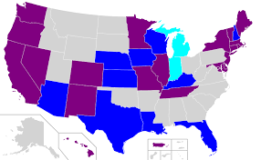
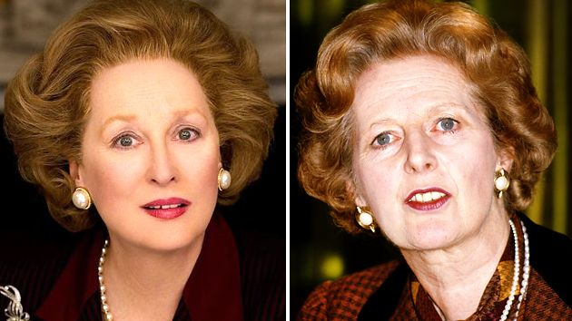

**[The slides](files/your-data-and-vis/yourdata.pdf)** - this page includes the same information, but you might prefer to follow along with the slides.  

# Exercises

In this session, we will be thrown from one real-life dataset to another to make quick judgments about which visualisation is most appropriate and how to construct it.

The datasets have been sourced from the political poll website [FiveThirtyEight](https://data.fivethirtyeight.com/), founded by America's most famous data analyst, [Nate Silver](https://en.wikipedia.org/wiki/Nate_Silver). If you want to hone your skills further, you can find many more CC-licensed datasets there.

We have cleaned the data for you and will show you a snippet of what its structure looks like. Based on that structure, in groups of three:

* discuss *which* visualisation would be appropriate (there is no unique right answer here) 

* implement it in `ggplot2` by choosing the aesthetics and geom objects

* bonus points if you add sensible labels and axes

Think of it as a "visualiz-athon", but don't stress about finishing all of them. In fact, feel free to pick and choose whichever dataset tickles your fancy.

First, however, we will need to install and attach the following libraries. We install using, for example, `install.packages("tidyverse")`.

```{r setup, message=FALSE}
library(tidyverse)
library(RCurl) #Case-sensitive
library(ggmap)
library(maps)
library(network)
library(sna)
library(GGally)
```

## 1. What predicts hate crimes in America?

**Dataset: [hate_crimes.csv](files/your-data-and-vis/hate_crimes.csv)**

The US has an acute problem with hate crimes. In the week following Trump's 2016 election night, the hate crimes famously spiked compared with the long-running average.

Sociologists argue that it is not a uniformly distributed problem, however. They suspect that it could be related to factors like inequality, urban living and median income.



They have data on the average number of hate crimes (per 100,000 people) in USA between 2010 and 2015 for each American state. They also have a measurement for inequality called gini_index, the proportion of people living in metro areas, and the median income of the state.

As you see below, the dataframe is called `hatedata` and its columns are called `median_houshold_income`, `gini_index`, and `share_population_in_metro_areas`.


```{r hate, echo=FALSE, warning=FALSE}
hatedata <- read.csv("files/your-data-and-vis/hate_crimes.csv", header = T)

hatedata <- hatedata %>% select(state, median_household_income, gini_index, share_population_in_metro_areas, avg_hatecrimes_per_100k_fbi)

#head(hatedata)
head(as_tibble(hatedata)) %>% knitr::kable(digits = 5, caption = "Hate crime data")

```


What would be a suitable visualization for sociologists to investigate whether these three factors play a role? Is it feasible to combine them all into one or are they better split into several graphs? What possible problems do you see in your graph that could make analysis more difficult?

```{r, eval=FALSE}

ggplot(hatedata, aes(x=____, y=_____)) + geom___()


```


## 2. Do Pulitzers matter for a newspaper's growth?

**Dataset: [pulitzer-circulation-data.csv](files/your-data-and-vis/pulitzer-circulation-data.csv)**

The finest honour any investigative journalist could aspire to is called the Pulitzer Prize. The owners of the newspaper they work for surely wouldn't mind either, as this could lead to a boost in circulation. But is there empirical evidence to support their assumption that Pulitzers matter for sales?


In the dataset below, called `puldata`, there is information on the size of their circulation in 2004 (` Daily.Circulation..2004`), the percentage by which it grew or declined between 2004 and 2013 (`Change.in.Daily.Circulation`) and finally how many Pulitzer Prize winners worked at the newspaper between those years (`Pulitzer.Prize.Winners.and.Finalists..2004.2014`).


```{r pulitzer, echo=FALSE, warning=FALSE}
puldata <- read.csv("files/your-data-and-vis/pulitzer-circulation-data.csv", header = T)

puldata <- puldata %>% select(Daily.Circulation..2004, Change.in.Daily.Circulation..2004.2013, Pulitzer.Prize.Winners.and.Finalists..2004.2014)

puldata$Daily.Circulation..2004 <- as.numeric(sub(",", "", puldata$Daily.Circulation..2004, fixed = TRUE))

head(as_tibble(puldata)) %>% knitr::kable(digits = 5, caption = "Pulitzer and Newspaper data")
#as_tibble(puldata) 

```


Is there a relationship, would you say? Is there a way to make the visualisation also show whether the initial 2004 circulation influenced the Pulitzer-fueled growth?

```{r, eval=FALSE}

ggplot(puldata, aes(x=________________)) + geom______()

```

## 3. What is the shape of Trump's twitter popularity?

**Dataset: [realDonaldTrump.csv](files/your-data-and-vis/realDonaldTrump.csv)**

Now to American politics and their principal arena: the Twitter-verse. 


Trump boasts an impressive following of more than 150 million accounts (perhaps with a few Russian bots included), but follower numbers never give a full story. Political scientists may want to have a closer look at the number of interactions, and specifically how many people like (or 'favorite') his tweets. 

In the `trumpdata` prepared below, there is a `url` giving the link to his tweet, `replies`, `retweets`, and `favorites`.

```{r trump, echo=FALSE, warning=FALSE}
trumpdata <- read.csv("files/your-data-and-vis/realDonaldTrump.csv", header = T)

trumpdata <- trumpdata %>% select(url,replies, retweets, favorites)

head(as_tibble(trumpdata)) %>% knitr::kable(digits = 5, caption = "Trump Twitter data")
#as_tibble(trumpdata) 

```

How could you show to political scientists the general tendencies of his favorite-numbers? Are they always hovering around the same number? Are some massively more popular than most?

```{r, eval=FALSE}
ggplot(trumpdata, aes(x=_____)) + geom______()

```

## 4. Which politicians are most rapped about?

**Dataset: [genius_hip_hop_lyrics.csv](files/your-data-and-vis/genius_hip_hop_lyrics.csv)**

On the same political note, but on a different platform, data from the musical lyrics website [Genius.com](www.genius.com) reveals that politcians are a favourite topic in rap songs. This popularity stretches decades back. 


Clever social scientists studying this phenomenon have applied a technique called *sentiment analysis* to determine whether the rapper's attitude towards the politician is positive, negative or neutral.

Have a look at the `hiphopdata` set below, and its three fields `candidate`, `song`, `artist`, and `sentiment`.
 
```{r hiphop, echo=FALSE, warning=FALSE}
hiphopdata <- read.csv("files/your-data-and-vis/genius_hip_hop_lyrics.csv", header = T)

hiphopdata <- hiphopdata %>% select(candidate, song, artist, sentiment)

head(as_tibble(hiphopdata)) %>% knitr::kable(digits = 5, caption = "Hiphop Politics Data")
#as_tibble(hiphopdata) 

```

Which politicians are given the rap treatment most often, we wonder? And is there a way to visualize conveniently the proportion of different rap sentiments among the lyrical references?


```{r, eval=FALSE}
ggplot(hiphopdata, aes(x=_____, fill=______)) + geom_____(____)

```


## 5. Who cares about the Oxford comma?

**Dataset: [comma-survey.csv](files/your-data-and-vis/comma-survey.csv)**

Now for a controversial, English-related debate. As you may know, the *Oxford comma* refers to whether, at the end of a listing, you should add a comma or not before the last item. For example, is it right to say *It's important for a person to be honest, kind and loyal.* or would you rather have it as *It's important for a person to be honest, kind, and loyal*.


To settle the matter via democratic processes, a poll was conducted that asked people which option they preferred. The pollsters also asked about their education background, thinking that perhaps postgraduates would be more pedantic in the matter.

The data has been prepared below, in `commaperc`, which contains the percentages (`freq`) of people for each `Education` group who preferred one or the other.


```{r comma, echo=FALSE, warning=FALSE}

commadata <- read.csv("files/your-data-and-vis/comma-survey.csv", header = T)

commadata <- commadata %>% select(In.your.opinion..which.sentence.is.more.gramatically.correct., Education)

commadata <- rename(commadata, Opinion = In.your.opinion..which.sentence.is.more.gramatically.correct.)

commaperc <- commadata %>% group_by(Education, Opinion) %>% summarise (n = n()) %>% mutate(freq = n/sum(n))

head(as_tibble(commaperc)) %>% knitr::kable(digits = 5, caption = "Oxford Comma Opinions")
#as_tibble(commaperc) 

```

So, postgraduates - are we more pedantic about the Oxford commas? 

```{r, eval=FALSE}

ggplot(commaperc, aes(x=_____, y= _____, fill=_____)) + geom____(_____)

```


## 6. Which airlines are the best to fly with?

**Dataset: [airline-safety.csv](files/your-data-and-vis/airline-safety.csv)**

With the twin Boeing disasters fresh in memory, we are excused to sometimes worry a bit about the safety records of modern airlines. So let's have a look at them.

In the `airdata` dataset below, there is a number of fatalities between 2000-2014 given as a heartless statistic in `fatalities_00_14` for each `airline`. Have a look.

```{r air, echo=FALSE, warning=FALSE}

airdata <- read.csv("files/your-data-and-vis/airline-safety.csv", header = T)

airdata <- arrange(airdata, desc(fatalities_00_14))

head(as_tibble(airdata)) %>% knitr::kable(digits = 5, caption = "Airport fatality data")
#as_tibble(airdata) 
```

This data has already been sorted from high-to-low. We wonder of course whether we could summarise visually which airline we should avoid in the future, assuming that their past incidents has something to say about their future safety.

With so many airlines on display, is there a way to prevent it looking cluttered?

```{r, eval=FALSE}
ggplot(airdata, aes(y=_____, x=_____)) + geom___()  

```


## 7. What is the teenagers' drug of choice?

**Dataset: [drug-use-by-age.csv](files/your-data-and-vis/drug-use-by-age.csv)**

Many communities struggle with youth drug use, which could be carried over to later stages of life. To monitor the shares of people at different ages using drugs, authorities have collected cross-sectional data showing, for each drug, how many percent use it in each age interval.


This data is found in `drugdata`, which has the fields `drug` and `percentage`.


```{r drugs, echo=FALSE, warning=FALSE}

drugdata <- read.csv("files/your-data-and-vis/drug-use-by-age.csv", header = T)

drugdata <- drugdata %>% select(age, ends_with('use'), -starts_with("alcohol")) 

col_old <- colnames(drugdata)
col_new <- gsub(pattern = ".use",replacement = "", x  = col_old)
colnames(drugdata) <- col_new

drugdata <- drugdata %>% gather(drug, percentage, cocaine:sedative) 

head(as_tibble(drugdata)) %>% knitr::kable(digits = 5, caption = "Drug use data")
#as_tibble(drugdata) 

```

How could we look into the trends in different drugs' popularity over the life span? How could we minimise the visual confusion in doing so? 

```{r, eval=FALSE}
ggplot(drugdata, aes(x=____ , group=____, y=______)) + geom_____(___________)

```


## 8. Where are all the women in biopics?

**Dataset: [biopics.csv](files/your-data-and-vis/biopics.csv)**

Abraham Lincoln, Winston Churchill, and Freddie Mercury have all been the subject of a biographical motion picture, also known as *biopic*. Every Great Man of History seems to have led a Hollywood actor to an Oscar. But where are all the Women of History?



Film nerds have collected the following data `biopics` which shows the year of release (`year_release`), the gender of the subject (`subject_sex`), the `title`, the `subject` name and the `lead_actor_actress` who played them.

```{r biopics, echo=FALSE , warning=FALSE}

biopicdata <- read.csv("files/your-data-and-vis/biopics.csv", header = T)

biopicdata <- biopicdata %>% select(year_release, subject_sex, title, subject, lead_actor_actress )


head(as_tibble(biopicdata)) %>% knitr::kable(digits = 5, caption = "Biopic subject sex data")
#as_tibble(biopicdata) 

```

Is there a convenient way for us to visualize how this proportion in gender has changed over the last decades? Are female biopics on the rise or has it stayed constant?

```{r, eval=FALSE}
ggplot(biopicdata, aes(x=_______, fill=______)) + geom_____(____) 

```

## 9. Where do people marry their second cousins?

**Dataset: [cousin-marriage-data.csv](files/your-data-and-vis/cousin-marriage-data.csv)**

People born and bred in UK may be surprised to learn that marrying second cousins is a common practice. There are many reasons for doing so: staying close to the family and community, minimising the disruption of marriage, keeping property among consanguines...


We would therefore expect this to have a relationship with factors like poverty. In the data below, a dataframe containing the (`long`,`lat`) coordinates that define the corners of some countries has been merged with data that gives the `Percent` of how many people marry their second cousins.

```{r pressure, echo=FALSE, warning=FALSE}

cousindata <- read.csv("files/your-data-and-vis/cousin-marriage-data.csv", header = T)

map <- map_data("world")

map2 <- full_join(map, cousindata, by=c('region' = 'Country'))

head(as_tibble(map2)) %>% knitr::kable(digits = 5, caption = "Map data")
#as_tibble(map2) 
```

Moving into the territory of geospatial data visualization, could you figure out a way of showing in an overlay of the world map, how many people in each country engage in this practice?

```{r, eval=FALSE}
ggplot(map2, aes(x=___, y=____, group=_____, fill=______)) + geom______()


```


# Beyond ggplot2 (extension)

## 10. Network data: 

**Dataset: [love_actually_adjacencies.csv](files/your-data-and-vis/love_actually_adjacencies.csv)**

If you ever found yourself watching the romcom *Love, Actually* on Christmas, then you may have marvelled at how the screenwriters managed to weave together such a complex ensemble script. You may wonder if they ever used some kind of network visualization to map out all the character interactions.


Unfortunately, `ggplot` does not provide convenient support for networks, but via a set of libraries called `networks`, `sna` and `GGally` we could nevertheless cobble together a dataframe where the two first columns (`actor` and `actors`) give the characters in an interaction, and the third (`number`) gives the interaction frequency.

```{r cars, echo=FALSE, warning=FALSE}

ladata <- read.csv("files/your-data-and-vis/love_actually_adjacencies.csv", header = T)

ladata[is.na(ladata)] <- 0

ladata <- ladata %>% 
          gather(actor, number, bill_nighy:alan_rickman) %>%
           select(actors, actor, number) %>% 
          filter(number != 0)

lanet <- as.network(ladata, directed=FALSE, matrix.type = "edgelist")

head(as_tibble(ladata)) %>% knitr::kable(digits = 5, caption = "Love Actually data")

#as_tibble(ladata) 
```

Using the function `ggnet2` we could simply feed the network to it. Now you know! (no exercise for this one :) )

```{r}
ggnet2(lanet, label = TRUE, label.size = 5)

```

# Solutions

The solutions to all these questions can be downloaded here:

**[Solutions.Rmd](files/your-data-and-vis/Solutions.Rmd)**
